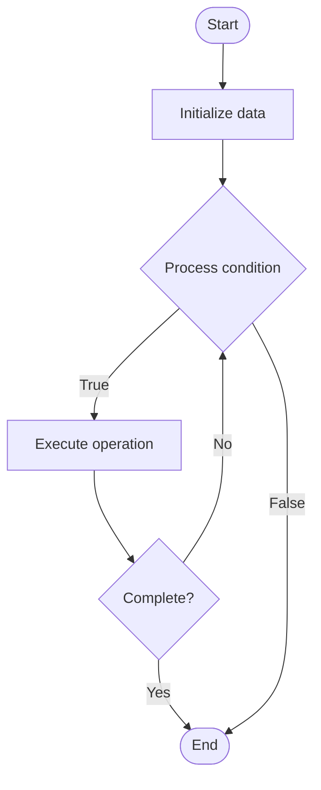

# AI-Powered Ticket Routing

1. **Name of Algorithm**  

## Code Files


## Algorithm Visualization

### Flowchart (ASCII)


```
AI-Powered Ticket Routing Flowchart:

┌─────────────┐
│   Start     │
└──────┬──────┘
       │
       ▼
┌─────────────┐
│  Initialize │
│   data      │
└──────┬──────┘
       │
       ▼
┌─────────────┐      Yes
│  Process   ├──────┐
│  condition?│      │
└──────┬──────┘      │
       │ No          │
       ▼             │
┌─────────────┐      │
│  Execute   │      │
│  operation │      │
└──────┬──────┘      │
       │             │
       └─────────────┘
       │
       ▼
┌─────────────┐
│    End      │
└─────────────┘
```


### Step-by-Step Execution


```
AI-Powered Ticket Routing Step-by-Step Execution:

Input: [example data]

Step 1: Initialize
State: [initial state]

Step 2: Process
State: [intermediate state]

Step 3: Finalize
State: [final state]

Result: [output]
```


### Interactive Flowchart (Mermaid)





> **Note**: Mermaid diagrams are rendered automatically on GitHub. For local viewing, use a Mermaid-compatible Markdown viewer.
- [Python Implementation](semester_14/lecture_95_support_advanced/ticket_routing_ai/algorithm.py)
- [Java Implementation](semester_14/lecture_95_support_advanced/ticket_routing_ai/Algorithm.java)
- [Python Tests](semester_14/lecture_95_support_advanced/ticket_routing_ai/test_algorithm.py)


   AI-Powered Ticket Routing

2. **What problem does it solve? (1 sentence)**  
Automatically routes support tickets to the most appropriate agent or team using AI to analyze ticket content, agent expertise, workload, and historical performance for optimal assignment.

3. **Intuition (plain-language explanation)**  
Like a smart dispatcher: AI ticket routing is like a smart dispatcher - you analyze the request (ticket content), know who's available (agent workload), match expertise (agent skills), and route efficiently (optimal assignment) - just as a dispatcher routes calls, AI routes tickets to the right person.

4. **Inputs & Outputs**  
   - Input: Support tickets, ticket content, agent profiles, agent workload, historical performance, routing rules, priority levels.  
   - Output: Routed tickets, routing decisions, agent assignments, routing confidence scores, routing metrics, optimization recommendations.

5. **Step-by-step description (5–10 lines max)**  
1. Receive: receive incoming support ticket.
2. Analyze: analyze ticket content using NLP.
3. Classify: classify ticket type and priority.
4. Match: match ticket to agent expertise.
5. Check: check agent availability and workload.
6. Route: route ticket to optimal agent.
7. Learn: learn from routing outcomes.
8. Optimize: optimize routing based on performance.
9. Monitor: monitor routing effectiveness.
10. Improve: improve routing algorithm.

6. **Tiny example (hand-simulated)**  
   Ticket Routing: receive ticket → analyze (billing issue) → classify → match to billing expert → check availability → route → learn → optimize → Ticket Routing successful.

7. **Time & Space Complexity**  
   - Time: O(t * r) where t is ticket processing, r is routing complexity (routing complexity).  
   - Space: O(a + h) where a is agent data, h is history (routing storage).

8. **Strengths**  
- Efficiency: improves routing efficiency and speed.
- Accuracy: routes tickets to appropriate agents.
- Optimization: optimizes agent workload distribution.

9. **Weaknesses / limitations**  
- Complexity: requires sophisticated AI and training.
- Accuracy: may have limitations in complex scenarios.
- Maintenance: requires ongoing training and maintenance.

10. **Compare with alternatives**  
    Alternatives: Manual Routing, Rule-Based Routing, Round-Robin, Priority-Based

11. **30-second explanation (your own words)**  
    AI systems that automatically route support tickets to the most appropriate agents based on content analysis, expertise matching, and workload optimization.

*Sources: Adapted from standard university textbooks and Wikipedia summaries.*
