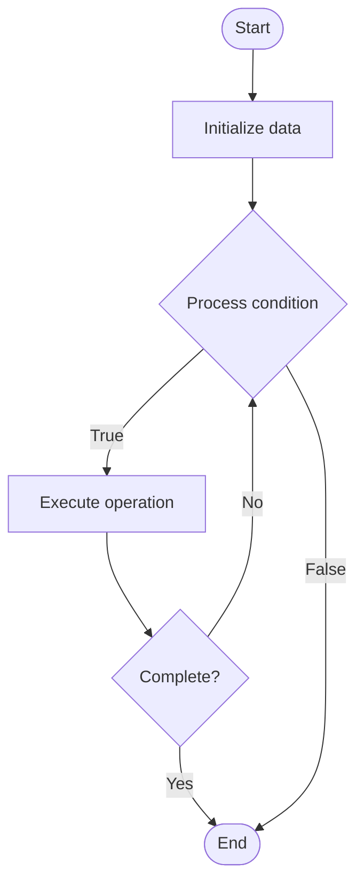

# Alert Fatigue Reduction

1. **Name of Algorithm**  

## Code Files


## Algorithm Visualization

### Flowchart (ASCII)


```
Alert Fatigue Reduction Flowchart:

┌─────────────┐
│   Start     │
└──────┬──────┘
       │
       ▼
┌─────────────┐
│  Initialize │
│   data      │
└──────┬──────┘
       │
       ▼
┌─────────────┐      Yes
│  Process   ├──────┐
│  condition?│      │
└──────┬──────┘      │
       │ No          │
       ▼             │
┌─────────────┐      │
│  Execute   │      │
│  operation │      │
└──────┬──────┘      │
       │             │
       └─────────────┘
       │
       ▼
┌─────────────┐
│    End      │
└─────────────┘
```


### Step-by-Step Execution


```
Alert Fatigue Reduction Step-by-Step Execution:

Input: [example data]

Step 1: Initialize
State: [initial state]

Step 2: Process
State: [intermediate state]

Step 3: Finalize
State: [final state]

Result: [output]
```


### Interactive Flowchart (Mermaid)





> **Note**: Mermaid diagrams are rendered automatically on GitHub. For local viewing, use a Mermaid-compatible Markdown viewer.
- [Python Implementation](semester_14/lecture_96_incident_management_advanced/alert_fatigue_reduction/algorithm.py)
- [Java Implementation](semester_14/lecture_96_incident_management_advanced/alert_fatigue_reduction/Algorithm.java)
- [Python Tests](semester_14/lecture_96_incident_management_advanced/alert_fatigue_reduction/test_algorithm.py)


   Alert Fatigue Reduction

2. **What problem does it solve? (1 sentence)**  
Reduces alert fatigue by filtering, prioritizing, grouping, and intelligently managing alerts to ensure operators focus on critical issues without being overwhelmed by noise.

3. **Intuition (plain-language explanation)**  
Like a smart filter for alerts: Alert fatigue reduction is like a smart filter for alerts - you filter out noise (false positives, low priority), prioritize important ones (critical alerts), group related ones (similar alerts), and present only what matters - just as a spam filter reduces email noise, alert reduction reduces alert noise.

4. **Inputs & Outputs**  
   - Input: Alerts, alert metadata, historical data, priority rules, grouping criteria, filtering rules, context information.  
   - Output: Filtered alerts, prioritized alerts, grouped alerts, reduced alert volume, alert summaries, fatigue metrics.

5. **Step-by-step description (5–10 lines max)**  
1. Collect: collect all incoming alerts.
2. Filter: filter out false positives and noise.
3. Prioritize: prioritize alerts by severity and impact.
4. Group: group related or duplicate alerts.
5. Deduplicate: remove duplicate alerts.
6. Summarize: summarize grouped alerts.
7. Present: present only critical alerts.
8. Suppress: suppress low-priority alerts.
9. Learn: learn from alert patterns.
10. Optimize: optimize filtering and prioritization.

6. **Tiny example (hand-simulated)**  
   Alert Reduction: collect 1000 alerts → filter (remove 600 false positives) → prioritize → group (200 into 20 groups) → present 50 critical → Alert Reduction successful (95% reduction).

7. **Time & Space Complexity**  
   - Time: O(a * f) where a is alerts, f is filtering complexity (alert reduction complexity).  
   - Space: O(a + r) where a is alerts, r is rules (alert storage).

8. **Strengths**  
- Focus: helps operators focus on critical issues.
- Efficiency: reduces time spent on non-critical alerts.
- Quality: improves alert quality and relevance.

9. **Weaknesses / limitations**  
- Risk: may filter out important alerts if not careful.
- Complexity: requires sophisticated filtering algorithms.
- Tuning: requires careful tuning of rules and thresholds.

10. **Compare with alternatives**  
    Alternatives: No Filtering, Basic Filtering, Manual Prioritization, Threshold-Based

11. **30-second explanation (your own words)**  
Systems that reduce alert fatigue by intelligently filtering, prioritizing, and grouping alerts to ensure operators focus on critical issues.

*Sources: Adapted from standard university textbooks and Wikipedia summaries.*
