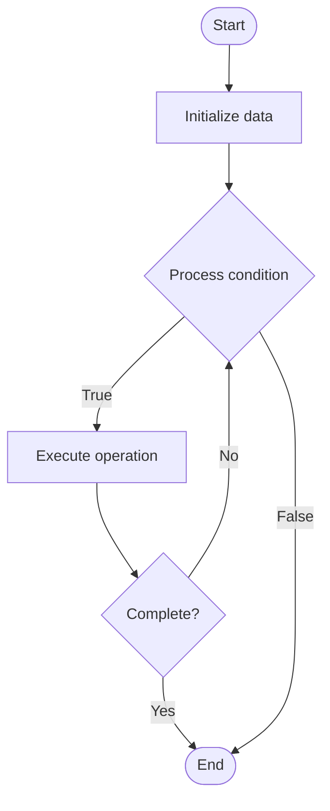

# Blameless Postmortem Culture

1. **Name of Algorithm**  

## Code Files


## Algorithm Visualization

### Flowchart (ASCII)


```
Blameless Postmortem Culture Flowchart:

┌─────────────┐
│   Start     │
└──────┬──────┘
       │
       ▼
┌─────────────┐
│  Initialize │
│   data      │
└──────┬──────┘
       │
       ▼
┌─────────────┐      Yes
│  Process   ├──────┐
│  condition?│      │
└──────┬──────┘      │
       │ No          │
       ▼             │
┌─────────────┐      │
│  Execute   │      │
│  operation │      │
└──────┬──────┘      │
       │             │
       └─────────────┘
       │
       ▼
┌─────────────┐
│    End      │
└─────────────┘
```


### Step-by-Step Execution


```
Blameless Postmortem Culture Step-by-Step Execution:

Input: [example data]

Step 1: Initialize
State: [initial state]

Step 2: Process
State: [intermediate state]

Step 3: Finalize
State: [final state]

Result: [output]
```


### Interactive Flowchart (Mermaid)





> **Note**: Mermaid diagrams are rendered automatically on GitHub. For local viewing, use a Mermaid-compatible Markdown viewer.
- [Python Implementation](semester_14/lecture_96_incident_management_advanced/blameless_culture/algorithm.py)
- [Java Implementation](semester_14/lecture_96_incident_management_advanced/blameless_culture/Algorithm.java)
- [Python Tests](semester_14/lecture_96_incident_management_advanced/blameless_culture/test_algorithm.py)


   Blameless Postmortem Culture

2. **What problem does it solve? (1 sentence)**  
   Establishes a culture and process for conducting blameless postmortems that focus on learning from incidents, improving systems, and preventing recurrence rather than assigning blame.

3. **Intuition (plain-language explanation)**  
   Like a learning-focused investigation: Blameless culture is like a learning-focused investigation - when something goes wrong (incident), you investigate to learn (root cause), improve (fixes), and prevent (changes) - you don't blame people, you fix systems - just as a safety investigation focuses on prevention, blameless culture focuses on improvement.

4. **Inputs & Outputs**  
   - Input: Incident data, timeline information, system logs, team input, postmortem templates, improvement tracking, culture guidelines.  
   - Output: Postmortem reports, root cause analysis, improvement actions, prevention measures, culture guidelines, learning outcomes.

5. **Step-by-step description (5–10 lines max)**  
1. Prepare: prepare for postmortem meeting.
2. Gather: gather incident data and timeline.
3. Conduct: conduct blameless postmortem discussion.
4. Analyze: analyze root causes (not blame).
5. Document: document findings and learnings.
6. Action: identify improvement actions.
7. Implement: implement improvements.
8. Track: track action items and improvements.
9. Share: share learnings across organization.
10. Iterate: iterate on postmortem process.

6. **Tiny example (hand-simulated)**  
   Blameless Culture: prepare → gather data → conduct meeting (focus on system, not people) → analyze root cause → document → action items → implement → track → Blameless Culture successful.

7. **Time & Space Complexity**  
   - Time: O(i * p) where i is incident complexity, p is postmortem process time (postmortem complexity).  
   - Space: O(d + r) where d is documentation, r is reports (postmortem storage).

8. **Strengths**  
- Learning: promotes learning and improvement.
- Culture: builds positive, learning-focused culture.
- Prevention: helps prevent future incidents.

9. **Weaknesses / limitations**  
- Culture: requires cultural change and buy-in.
- Time: requires time investment for postmortems.
- Execution: requires careful execution to maintain blameless focus.

10. **Compare with alternatives**  
    Alternatives: Blaming Culture, No Postmortems, Formal Investigations, Informal Reviews

11. **30-second explanation (your own words)**  
    Culture and processes that focus on learning from incidents through blameless postmortems rather than assigning blame, promoting improvement and prevention.

*Sources: Adapted from standard university textbooks and Wikipedia summaries.*
