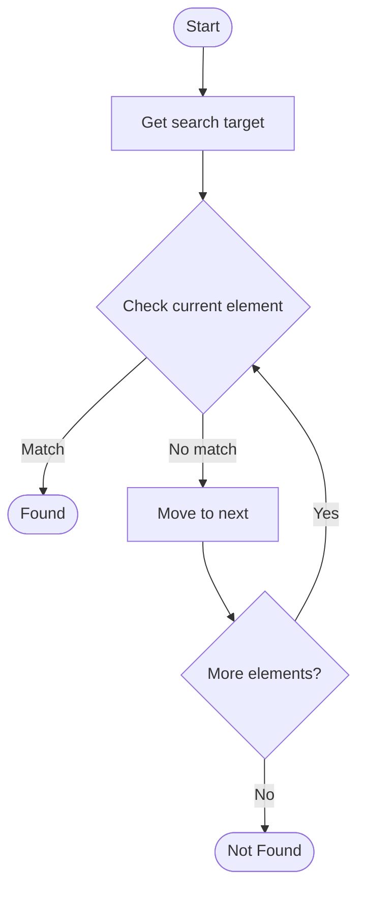

# Semantic Search

Name of Algorithm  

## Code Files


## Algorithm Visualization

### Flowchart (ASCII)


```
Semantic Search Flowchart:

┌─────────────┐
│   Start     │
└──────┬──────┘
       │
       ▼
┌─────────────┐
│  Get search │
│    target   │
└──────┬──────┘
       │
       ▼
┌─────────────┐      Yes
│  Check     ├──────┐
│  current   │      │
│  element?  │      │
└──────┬──────┘      │
       │ No          │
       ▼             │
┌─────────────┐      │
│   Move to   │      │
│   next      │      │
└──────┬──────┘      │
       │             │
       └─────────────┘
       │
       ▼
┌─────────────┐
│   Found?    │
└──────┬──────┘
       │
       ▼
┌─────────────┐
│    End      │
└─────────────┘
```


### Step-by-Step Execution


```
Semantic Search Step-by-Step Execution:

Array: [1, 3, 5, 7, 9, 11]
Target: 7

Step 1: Check middle (index 2, value 5)
[1, 3, 5, 7, 9, 11]
         ↑
5 < 7, search right

Step 2: Check middle of right half (index 4, value 9)
[7, 9, 11]
    ↑
9 > 7, search left

Step 3: Check remaining (index 3, value 7)
[7]
 ↑
Found! Index 3
```


### Interactive Flowchart (Mermaid)





> **Note**: Mermaid diagrams are rendered automatically on GitHub. For local viewing, use a Mermaid-compatible Markdown viewer.
- [Python Implementation](/code/semester_14/lecture_97_knowledge_management/semantic_search/algorithm.py)
- [Java Implementation](/code/semester_14/lecture_97_knowledge_management/semantic_search/Algorithm.java)
- [Python Tests](/code/semester_14/lecture_97_knowledge_management/semantic_search/test_algorithm.py)


   Semantic Search

What problem does it solve? (1 sentence)  
Implements semantic search algorithm.

Intuition (plain-language explanation)  
Semantic Search is a fundamental algorithm in computer science.

Inputs & Outputs  
   - Input: Algorithm-specific inputs  
   - Output: Algorithm-specific outputs

Step-by-step description (5–10 lines max)  
Initialize data structures
Process input according to algorithm logic
Return computed result

Tiny example (hand-simulated)  
   Example: Semantic Search applied to sample data.

Time & Space Complexity  
   - Time: Varies  
   - Space: Varies

Strengths  
- Efficient for specific use cases

Weaknesses / limitations  
- May have limitations in certain scenarios

Compare with alternatives  
    Alternatives: Related algorithms

30-second explanation (your own words)  
    Semantic Search solves computational problems efficiently.

*Sources: Adapted from standard university textbooks and Wikipedia summaries.*
