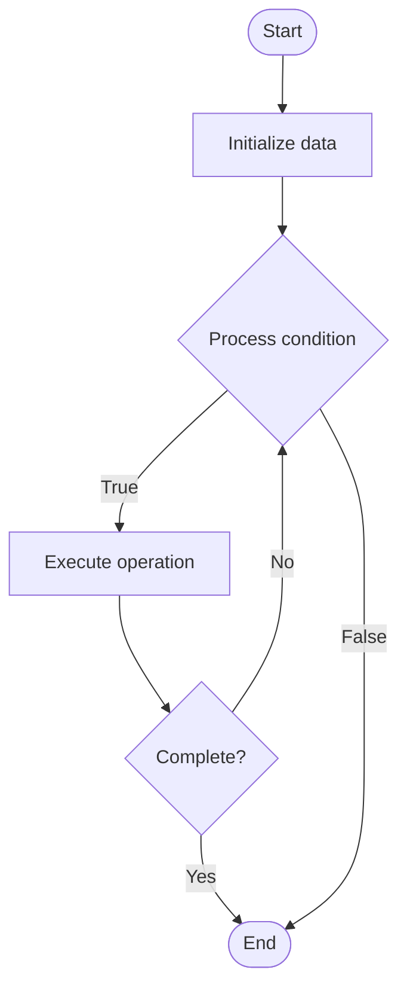

# Accessibility Docs

1. **Name of Algorithm**  

## Code Files


## Algorithm Visualization

### Flowchart (ASCII)


```
Accessibility Docs Flowchart:

┌─────────────┐
│   Start     │
└──────┬──────┘
       │
       ▼
┌─────────────┐
│  Initialize │
│   data      │
└──────┬──────┘
       │
       ▼
┌─────────────┐      Yes
│  Process   ├──────┐
│  condition?│      │
└──────┬──────┘      │
       │ No          │
       ▼             │
┌─────────────┐      │
│  Execute   │      │
│  operation │      │
└──────┬──────┘      │
       │             │
       └─────────────┘
       │
       ▼
┌─────────────┐
│    End      │
└─────────────┘
```


### Step-by-Step Execution


```
Accessibility Docs Step-by-Step Execution:

Input: [example data]

Step 1: Initialize
State: [initial state]

Step 2: Process
State: [intermediate state]

Step 3: Finalize
State: [final state]

Result: [output]
```


### Interactive Flowchart (Mermaid)





> **Note**: Mermaid diagrams are rendered automatically on GitHub. For local viewing, use a Mermaid-compatible Markdown viewer.
- [Python Implementation](semester_14/lecture_99_technical_writing_advanced/accessibility_docs/algorithm.py)
- [Java Implementation](semester_14/lecture_99_technical_writing_advanced/accessibility_docs/Algorithm.java)
- [Python Tests](semester_14/lecture_99_technical_writing_advanced/accessibility_docs/test_algorithm.py)


   Accessibility Docs

2. **What problem does it solve? (1 sentence)**  
Implements accessibility docs algorithm.

3. **Intuition (plain-language explanation)**  
Accessibility Docs is a fundamental algorithm in computer science.

4. **Inputs & Outputs**  
   - Input: Algorithm-specific inputs  
   - Output: Algorithm-specific outputs

5. **Step-by-step description (5–10 lines max)**  
1. Initialize data structures
2. Process input according to algorithm logic
3. Return computed result

6. **Tiny example (hand-simulated)**  
   Example: Accessibility Docs applied to sample data.

7. **Time & Space Complexity**  
   - Time: Varies  
   - Space: Varies

8. **Strengths**  
- Efficient for specific use cases

9. **Weaknesses / limitations**  
- May have limitations in certain scenarios

10. **Compare with alternatives**  
    Alternatives: Related algorithms

11. **30-second explanation (your own words)**  
    Accessibility Docs solves computational problems efficiently.

*Sources: Adapted from standard university textbooks and Wikipedia summaries.*
