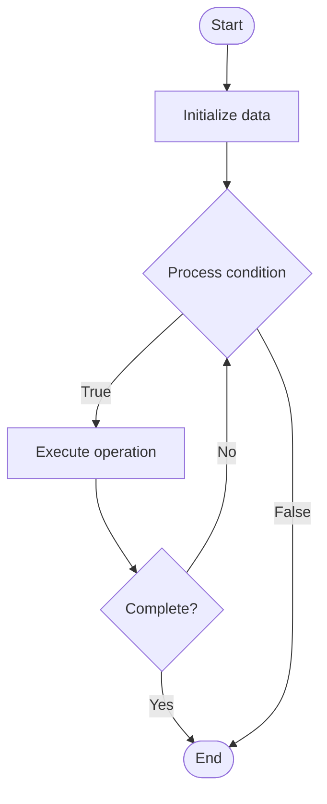

# Kappa Architecture

## Учебные материалы

- [Школьный уровень](school.ru.md)
- [Университетский уровень](univer.ru.md)

## Algorithm Visualization

### Flowchart (ASCII)

```
Kappa Architecture Flowchart:

┌─────────────┐
│   Start     │
└──────┬──────┘
       │
       ▼
┌─────────────┐
│  Initialize │
│   data      │
└──────┬──────┘
       │
       ▼
┌─────────────┐      Yes
│  Process   ├──────┐
│  condition?│      │
└──────┬──────┘      │
       │ No          │
       ▼             │
┌─────────────┐      │
│  Execute   │      │
│  operation │      │
└──────┬──────┘      │
       │             │
       └─────────────┘
       │
       ▼
┌─────────────┐
│    End      │
└─────────────┘
```

### Step-by-Step Execution

```
Kappa Architecture Step-by-Step Execution:

Input: [example data]

Step 1: Initialize
State: [initial state]

Step 2: Process
State: [intermediate state]

Step 3: Finalize
State: [final state]

Result: [output]
```

### Interactive Flowchart (Mermaid)



> **Note**: Mermaid diagrams are rendered automatically on GitHub. For local viewing, use a Mermaid-compatible Markdown viewer.

- [Python Implementation](/code/semester_16/lecture_111_data_engineering_advanced/kappa_architecture/algorithm.py)
- [Java Implementation](/code/semester_16/lecture_111_data_engineering_advanced/kappa_architecture/Algorithm.java)
- [Python Tests](/code/semester_16/lecture_111_data_engineering_advanced/kappa_architecture/test_algorithm.py)

What problem does it solve? (1 sentence)  
Implements kappa architecture algorithm.

Intuition (plain-language explanation)  
Kappa Architecture is a fundamental algorithm in computer science.

Inputs & Outputs  

  - Input: Algorithm-specific inputs  
  - Output: Algorithm-specific outputs

Step-by-step description (5–10 lines max)  
Initialize data structures
Process input according to algorithm logic
Return computed result

Tiny example (hand-simulated)  
   Example: Kappa Architecture applied to sample data.

Time & Space Complexity  

  - Time: Varies  
  - Space: Varies

Strengths  

- Efficient for specific use cases

Weaknesses / limitations  

- May have limitations in certain scenarios

Compare with alternatives  
    Alternatives: Related algorithms

30-second explanation (your own words)  
    Kappa Architecture solves computational problems efficiently.

*Sources: Adapted from standard university textbooks and Wikipedia summaries.*


## Historical Context

Lambda architecture is a data-processing architecture designed to handle massive quantities of data by taking advantage of both batch and stream-processing methods. This approach to architecture attempts to balance latency, throughput, and fault-tolerance by using batch processing to provide compreh


## References

- [Lambda architecture](https://en.wikipedia.org/wiki/Lambda_architecture) - Wikipedia
